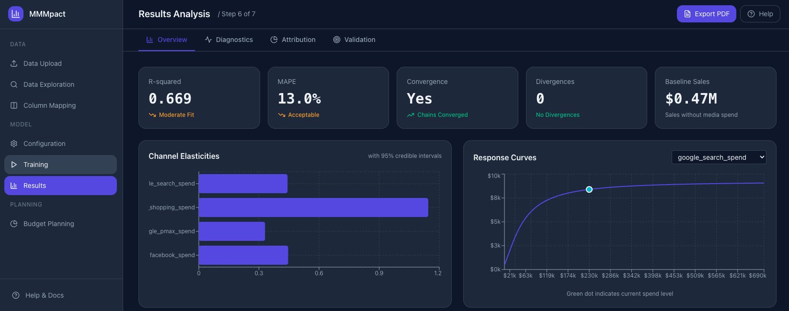

# Marketing Mix Modelling - Complete Example

A practical implementation of Marketing Mix Modelling (MMM) using Bayesian methods, based on the concepts from [Marketing Mix Modelling: The Complete Guide](MMM_Complete_Guide_v7.docx) by Mark Stent.

## About This Project

The accompanying guide was written to incorporate as many MMM concepts as possible into a single resource. However, it's important to note:

- **Not exhaustive**: The guide doesn't cover every aspect of MMM - it's a comprehensive starting point, not the final word
- **Bayesian focus**: This implementation uses Bayesian methods exclusively. There are other valid approaches (frequentist regression, machine learning methods, etc.) that are not covered here
- **Two implementations**: This repository includes both additive and multiplicative model specifications, demonstrating different approaches to MMM

The goal is to provide a solid foundation for understanding and implementing Bayesian MMM, which you can then adapt to your specific needs.

## Project Structure

```
MMM-guide/
├── notebooks/                  # Jupyter notebooks with full MMM examples
│   ├── mmm_complete_example.ipynb       # Additive model
│   └── mmm_multiplicative_example.ipynb # Multiplicative model
├── frontend/                   # Next.js web application
│   └── src/app/               # React pages (upload, explore, config, etc.)
├── backend/                    # FastAPI backend server
│   ├── main.py                # API endpoints for model training
│   └── core/                  # Core MMM modules
│       ├── __init__.py
│       ├── transformations.py # Adstock, saturation functions
│       ├── models.py          # PyMC model building
│       ├── attribution.py     # Channel contribution analysis
│       └── optimization.py    # Budget optimization
├── conjura_mmm_data.csv       # Raw dataset
├── mmm_weekly_clean.csv       # Preprocessed weekly data
├── pyproject.toml             # Python dependencies
└── README.md
```

## Notebooks

All notebooks are located in the `notebooks/` folder.

| Notebook | Model Type | Description |
|----------|------------|-------------|
| `notebooks/mmm_complete_example.ipynb` | **Additive** | Standard MMM: `Sales = Baseline + Media_Effects + Controls` |
| `notebooks/mmm_multiplicative_example.ipynb` | **Multiplicative** | Log-log and lift-factor models with Shapley decomposition |

### When to Use Each

- **Additive Model**: Simpler interpretation, straightforward decomposition, works well for most cases
- **Multiplicative Model**: Better when channels interact strongly, coefficients are elasticities, requires Shapley values for attribution

## Web Application

The project includes a modern web application (MMMpact) that provides a no-code interface for building and deploying Marketing Mix Models. It's designed for marketing analysts and data scientists who want to run MMM analysis without writing Python code.



### What It Does

**MMMpact** guides you through the complete MMM workflow:

- **Upload your data** - Drag and drop CSV/Excel files or use the built-in demo dataset
- **Explore and validate** - Visualize trends, check data quality, and understand your marketing spend patterns
- **Configure the model** - Set adstock decay rates, saturation curves, and Bayesian priors per channel
- **Train with confidence** - Run MCMC sampling with real-time progress and convergence diagnostics
- **Understand results** - Interactive charts showing channel contributions, ROI, response curves, and model fit
- **Plan budgets** - Optimize allocation across channels, set constraints, compare scenarios, and export recommendations

### Who It's For

- **Marketing analysts** who need to measure channel effectiveness without coding
- **Data scientists** who want a faster way to iterate on MMM configurations
- **Agencies** presenting MMM insights to clients with interactive dashboards
- **Teams** collaborating on budget planning with exportable scenarios

### Running the Web App

1. Start the backend server:
```bash
cd backend
uv run uvicorn main:app --reload --port 8000
```

2. In a new terminal, start the frontend:
```bash
cd frontend
npm install
npm run dev
```

3. Open http://localhost:3000 in your browser

### Features (7-Step Workflow)

1. **Data Upload**: Upload CSV files or use the demo dataset
2. **Data Exploration**: Interactive charts and data quality analysis
3. **Column Mapping**: Map your columns to target, media spend, and controls
4. **Model Configuration**: Configure adstock, saturation, and MCMC parameters
5. **Model Training**: Train Bayesian MMM models with progress tracking
6. **Results Analysis**: View contributions, ROI, response curves, and diagnostics
7. **Budget Planning**: Optimize allocation, set constraints, create scenarios, and export plans

## Dataset

This project uses the [Multi-Region Marketing Mix Modeling Dataset](https://figshare.com/articles/dataset/Multi-Region_Marketing_Mix_Modeling_MMM_Dataset_for_Several_eCommerce_Brands/25314841) from Figshare, which contains e-commerce marketing data across multiple brands and channels.

## Topics Covered

### Additive Model (`notebooks/mmm_complete_example.ipynb`)

#### Part I: Data Foundations
- Loading and exploring marketing data
- Selecting appropriate data granularity (weekly aggregation)
- Exploratory data analysis

#### Part II: Data Preprocessing
- Handling missing values
- Identifying and handling outliers
- Scaling variables for modelling
- Creating derived variables

#### Part III: Multicollinearity Analysis
- Correlation matrix between channels
- Interpreting correlation levels
- Strategies for handling high correlation

#### Part IV: Media Transformations
- **Adstock (Carryover Effects)**: Geometric adstock transformation
- **Saturation (Diminishing Returns)**: Hill function implementation
- Complete transformation pipeline

#### Part V: Bayesian Model Building
- Prior specification (informed by domain knowledge)
- Complete model structure in PyMC
- MCMC sampling

#### Part VI: Convergence Diagnostics
- R-hat interpretation
- Effective Sample Size (ESS)
- Trace plot analysis

#### Part VII: Model Validation
- In-sample fit (R-squared, MAPE)
- Residual analysis
- Posterior predictive checks
- LOO-CV (Leave-One-Out Cross-Validation)

#### Part VIII: Results Analysis
- Response curves with uncertainty
- ROI calculation with credible intervals
- Sales decomposition
- Channel contribution analysis

#### Part IX: Budget Optimisation
- Marginal ROI calculation
- Optimal budget allocation
- Constraint handling

### Multiplicative Model (`notebooks/mmm_multiplicative_example.ipynb`)

Covers the same data preparation as the additive model, plus:

- **Log-Log Specification**: Elasticity-based model where coefficients represent % change
- **Lift-Factor Specification**: Multiplicative lifts from baseline with natural interactions
- **Shapley Value Decomposition**: Fair attribution for multiplicative models
- **Model Comparison**: Side-by-side comparison of both multiplicative approaches
- **Budget Optimization**: Allocation optimization using elasticities

Key differences from additive:
```
Additive:       Sales = Baseline + b1*X1 + b2*X2
Log-Log:        log(Sales) = a + b1*log(X1) + b2*log(X2)
Lift-Factor:    Sales = Baseline * (1 + lift_1) * (1 + lift_2)
```

## Setup

### Prerequisites
- Python 3.11+
- [uv](https://github.com/astral-sh/uv) package manager
- Node.js 18+ (for the web frontend)

### Installation

1. Clone this repository:
```bash
git clone <repository-url>
cd MMM-guide
```

2. Install Python dependencies using uv:
```bash
uv sync
```

3. Install frontend dependencies:
```bash
cd frontend
npm install
cd ..
```

4. Start Jupyter Lab for notebooks:
```bash
uv run jupyter lab
```

5. Open `notebooks/mmm_complete_example.ipynb` and run the cells

### Dependencies

Key packages used:
- **PyMC**: Bayesian modelling framework
- **ArviZ**: Bayesian diagnostics and visualization
- **Pandas/NumPy**: Data manipulation
- **SciPy**: Optimization algorithms
- **FastAPI**: Backend API server
- **Next.js/React**: Web frontend
- **Recharts**: Interactive charts

## Key Concepts

### The MMM Equation (Additive)
```
Sales = Baseline + Trend + Seasonality + Media_Effects + Noise
```

### The MMM Equation (Multiplicative)
```
Sales = Baseline * (1 + TV_lift) * (1 + Digital_lift) * Seasonality * exp(Noise)
```
Or in log-log form:
```
log(Sales) = alpha + elasticity_TV * log(TV) + elasticity_Digital * log(Digital) + ...
```

### Adstock Transformation
Models how advertising effects persist over time:
```
Adstock(t) = Spend(t) + lambda * Adstock(t-1)
```

### Hill Saturation Function
Models diminishing returns:
```
Response = x^S / (K^S + x^S)
```

Where:
- **K**: Half-saturation point (spend level at 50% effect)
- **S**: Shape parameter (controls curve steepness)

### Budget Optimization

The optimizer uses the log-log model formula to maximize total sales:
```
contribution = avg_sales * (spend / avg_spend)^elasticity
```

At the optimal allocation, marginal ROI is equalized across all channels.

## References

- Mark Stent, [Marketing Mix Modelling: The Complete Guide](MMM_Complete_Guide_v7.docx)
- [Figshare Dataset](https://figshare.com/articles/dataset/Multi-Region_Marketing_Mix_Modeling_MMM_Dataset_for_Several_eCommerce_Brands/25314841)
- [PyMC Documentation](https://www.pymc.io/)
